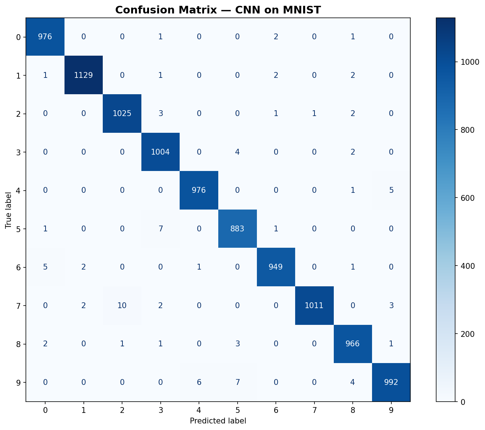

# CNN MNIST

## 项目介绍

本项目基于 PyTorch 构建了一个卷积神经网络（CNN），用于 MNIST 手写数字识别。MNIST 数据集包含 60,000 张训练图像和 10,000 张测试图像，每张为 28×28 像素的单通道灰度图像，涵盖 0-9 共 10 个数字类别。

项目完成了以下三个任务：

1. **手动推导参数量**：对给定的 3 卷积层 + 2 池化层 + 1 全连接层的 CNN 结构，逐层计算参数量
2. **PyTorch 实现与训练**：编写模型代码，在 MNIST 上训练并记录测试集准确率
3. **消融实验**：对比 ReLU、Sigmoid、Tanh 三种激活函数对收敛速度和最终准确率的影响

## 运行环境

- Python 3.13
- PyTorch 2.12.0 (CPU)
- torchvision
- matplotlib

```bash
pip install torch torchvision matplotlib
python cnn_mnist.py
```

## 网络结构

| 层 | 配置 | 输出尺寸 |
|----|------|----------|
| Input | 28×28 灰度图 | 1×28×28 |
| Conv1 | 3×3, 32 filters, stride=1, padding=1, 无偏置 | 32×28×28 |
| Pool1 | MaxPool 2×2, stride=2 | 32×14×14 |
| Conv2 | 3×3, 64 filters, stride=1, padding=1, 无偏置 | 64×14×14 |
| Pool2 | MaxPool 2×2, stride=2 | 64×7×7 |
| Conv3 | 3×3, 128 filters, stride=1, padding=1, 无偏置 | 128×7×7 |
| Flatten | — | 6272 |
| FC | 6272→10, 含偏置 | 10 |

## 参数量（共 155,178）

| 层 | 计算过程 | 参数量 |
|----|----------|--------|
| Conv1 | 3×3×1×32 | 288 |
| Conv2 | 3×3×32×64 | 18,432 |
| Conv3 | 3×3×64×128 | 73,728 |
| FC | 6272×10 + 10 | 62,730 |
| **总计** | | **155,178** |

## 实验结果

### 基础模型 (ReLU) — 综合指标

| 指标 | 结果 |
|------|------|
| 测试准确率 (Accuracy) | **99.11%** |
| Macro Precision | 0.9910 |
| Macro Recall | 0.9911 |
| Macro F1-Score | 0.9910 |
| 模型参数量 | 155,178 |
| 单批推理时间 (64 样本) | 13.24 ms |
| 全测试集推理时间 (10k) | 2.08 s |

### Per-Class 指标

| 类别 | Precision | Recall | F1-Score | Support |
|------|-----------|--------|----------|---------|
| 0 | 0.9909 | 0.9959 | 0.9934 | 980 |
| 1 | 0.9965 | 0.9947 | 0.9956 | 1,135 |
| 2 | 0.9894 | 0.9932 | 0.9913 | 1,032 |
| 3 | 0.9853 | 0.9941 | 0.9897 | 1,010 |
| 4 | 0.9929 | 0.9939 | 0.9934 | 982 |
| 5 | 0.9844 | 0.9899 | 0.9871 | 892 |
| 6 | 0.9937 | 0.9906 | 0.9922 | 958 |
| 7 | 0.9990 | 0.9835 | 0.9912 | 1,028 |
| 8 | 0.9867 | 0.9918 | 0.9892 | 974 |
| 9 | 0.9910 | 0.9832 | 0.9871 | 1,009 |
| **Avg** | **0.9910** | **0.9911** | **0.9910** | **10,000** |



### 消融实验：激活函数对比

| 激活函数 | 训练准确率 | 测试准确率 |
|----------|-----------|-----------|
| **ReLU** | 99.89% | **99.21%** |
| Sigmoid | 99.58% | 98.92% |
| Tanh | 99.49% | 98.65% |


### 实验分析

- **ReLU** 收敛最快、准确率最高，几乎每类 F1 都在 0.99 以上，无梯度饱和问题
- **Sigmoid** 早期收敛最慢（第 1 轮训练准确率仅 59.33%），存在梯度消失；最终准确率略低于 ReLU
- **Tanh** 表现居中，零中心化优于 Sigmoid，但后期测试 loss 波动较大，仍受梯度饱和影响
- 混淆矩阵显示，模型对各类数字的区分能力均很强，类别 5 和 9 的 recall 略低但在可接受范围
