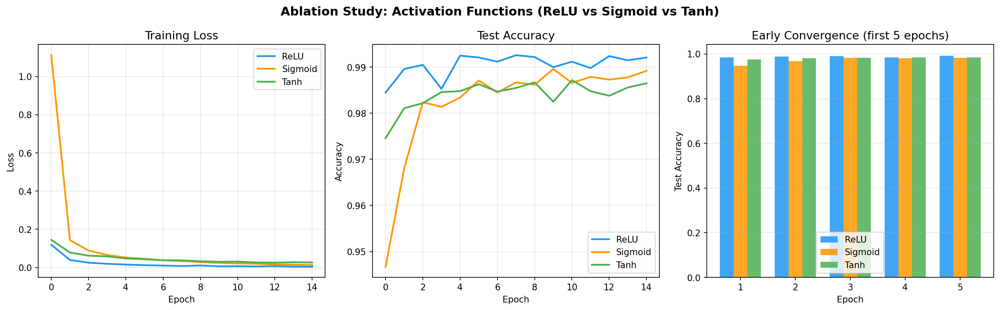

# CNN MNIST 手写体识别 — 深度学习期末作业

基于 PyTorch 实现的 CNN 手写体识别模型，包含参数量手动推导、模型训练与消融实验。

## 网络结构

| 层 | 配置 | 输出尺寸 |
|----|------|----------|
| Input | 28×28 灰度图 | 1×28×28 |
| Conv1 | 3×3, 32 filters, stride=1, padding=1, 无偏置 | 32×28×28 |
| Pool1 | MaxPool 2×2, stride=2 | 32×14×14 |
| Conv2 | 3×3, 64 filters, stride=1, padding=1, 无偏置 | 64×14×14 |
| Pool2 | MaxPool 2×2, stride=2 | 64×7×7 |
| Conv3 | 3×3, 128 filters, stride=1, padding=1, 无偏置 | 128×7×7 |
| Flatten | — | 6272 |
| FC | 6272→10, 含偏置 | 10 |

## 参数量（共 155,178）

| 层 | 计算过程 | 参数量 |
|----|----------|--------|
| Conv1 | 3×3×1×32 | 288 |
| Conv2 | 3×3×32×64 | 18,432 |
| Conv3 | 3×3×64×128 | 73,728 |
| FC | 6272×10 + 10 | 62,730 |
| **总计** | | **155,178** |

## 实验结果

### 基础模型 (ReLU)

| 指标 | 结果 |
|------|------|
| 训练准确率 | 99.89% |
| 测试准确率 | **99.21%** |

### 消融实验：激活函数对比

| 激活函数 | 训练准确率 | 测试准确率 |
|----------|-----------|-----------|
| **ReLU** | 99.89% | **99.21%** |
| Sigmoid | 99.58% | 98.92% |
| Tanh | 99.49% | 98.65% |

### 实验分析

- **ReLU** 收敛最快、准确率最高，无梯度饱和问题
- **Sigmoid** 早期收敛最慢（第 1 轮训练准确率仅 59.33%），存在梯度消失；最终准确率略低于 ReLU
- **Tanh** 表现居中，零中心化优于 Sigmoid，但后期测试 loss 波动较大，仍受梯度饱和影响



## 运行方式

```bash
pip install torch torchvision matplotlib
python cnn_mnist.py
```

## 文件说明

- `cnn_mnist.py` — 完整训练脚本，包含参数量推导、模型定义、训练与消融实验
- `ablation_activation.png` — 消融实验对比图（训练 loss 曲线、测试准确率曲线、早期收敛对比）
